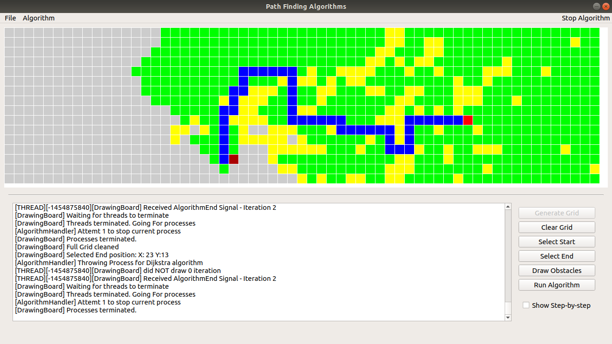

# Path Finding Project

## Summary

This project aims to provide a visual framework from which we can see the path finding algorithms in action and understand their diferences. It also serves as a platform to implement further path finding algorithms.

In order to allow the algorithm to run on its own, it runs in a separate process using the python's **multiprocessing** library. This project also takes advantage of the **multithreading** library to handle the drawing of eah update.

## How it works

This tool is built in Python3 using the Pyqt5 library. You just need to run the App by running the **run.sh** script:

```shell
sh ./run.sh
 ```

 Or, if you prefer:

 ```shell
 python3 algorithmApp.py
 ```
From the window that appears, just draw your starting, ending and obstacle points, select the algorithm to run and run it.

You may interrupt the algorithm at any time.


### Dependencies

In order to run this App you need to have iinstalled the following:

 * Pytho3
 * python3-pyqt5

## Algorithms

### Dijkstra

The firt path finding Algorithm implemented was Dijkstra's Algorithm.
It works under the following assumptions:
 * All edges have the same weight;
 * Each Node connects to the nodes on the left, right, up and down but not in the corners;
 * As the edges weigh the same, it stops when the end Node is found.



### A*

__[WIP]__